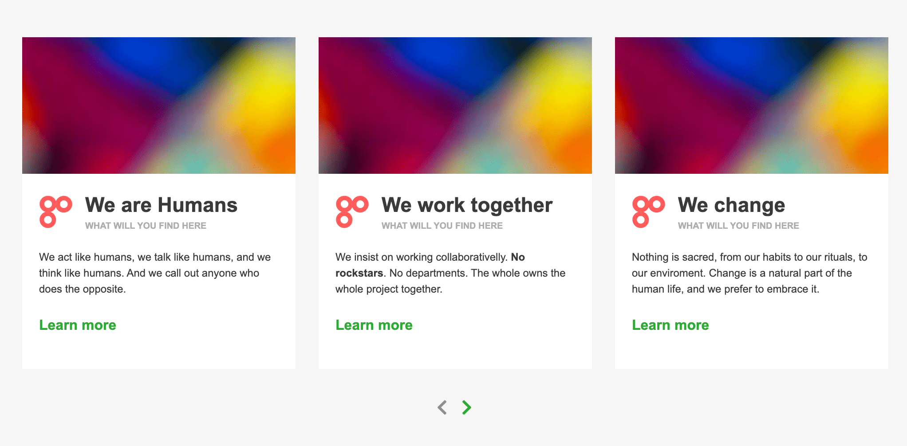

# Card Carousel & Dummy Card API
A card slider component built with vanilla JS. Displaying *dummy* data from a simple JSON server.

## Usage
Simply run

    yarn
    yarn start

and access ``http://127.0.0.1:3000/cards`` to get an array of data.

If you want to retrieve just a subset, specify the lower and upper limit as query parameters, for example:

    http://127.0.0.1:3000/cards?_start=8&_end=12

If you want to see the card slider in action, simlpy access ``http://127.0.0.1:3000/`` and you will see 2 demo carousels.

## Why?
Well, an interesting tech company called [gohenry](https://www.gohenry.com/uk/) asked me to build it. Yes, I know there are 100s of carousels around the internet which will likely to a much better job than this, but they wanted it built without such libraries/frameworks.

### What did you think of the exercise?
Despite feeling a little reluctant putting time into a tech test without even speaking to the company, it was an interesting enough challenge that I was able to use it to learn some new tools. For example, I used [chai.js](https://www.chaijs.com/) for some tests and learnt nice new functions like ``getComputedStyle()`` and ``new WebKitCSSMatrix``. Fun.